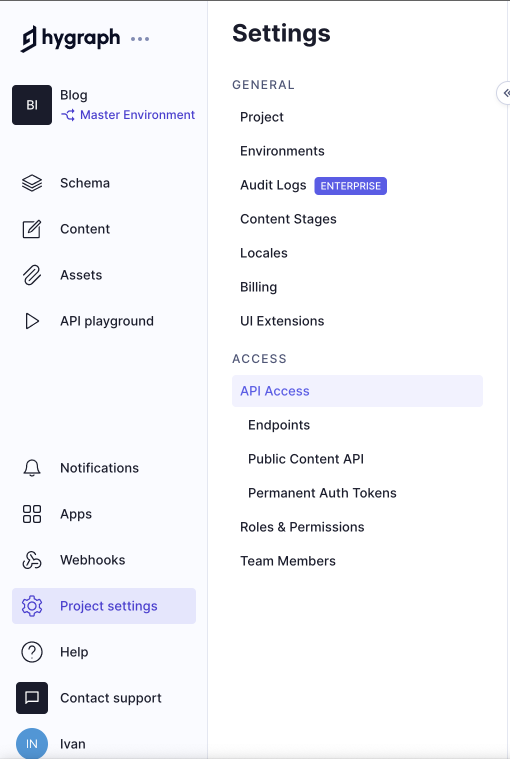
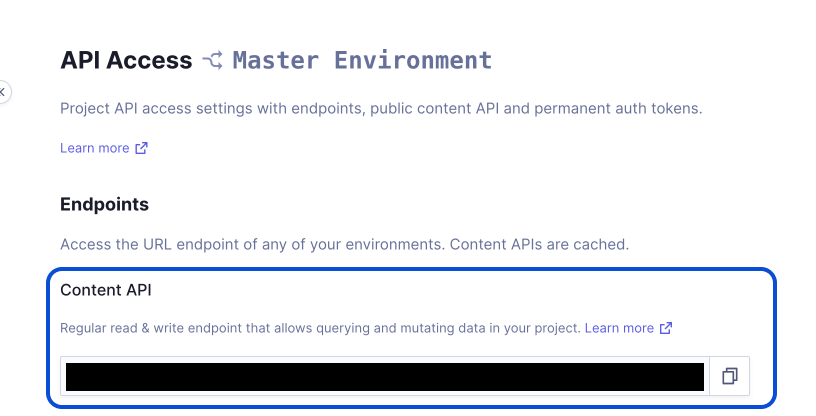

# Next.js with Hygraph Blog Starter
A starter repo for a blog bult with Next.js, HyGraph, TypeScript, and Tailwind CSS. 

Logo by <a href="https://www.freepik.com/free-vector/gradient-code-development-logo_11817413.htm#query=dev%20logo%20marketing&position=0&from_view=keyword&track=ais&uuid=b3f1ecea-40b2-490c-aee5-62365fdc170a">Freepik</a>

## Get up and running

Login to your HyGraph account and create a new template, selecting the **"Basic blog"** template provided from HyGraph's team.

Create a `.env.local` file in the root of this repository and add the following line: `HYGRAPH_ENDPOINT=insert-your-endpoint-here`.
For finding the endpoint, click on the link "Project Settings" in the sidebar on the left, the on "API Access". The string that you want to copy is the "Content API".

