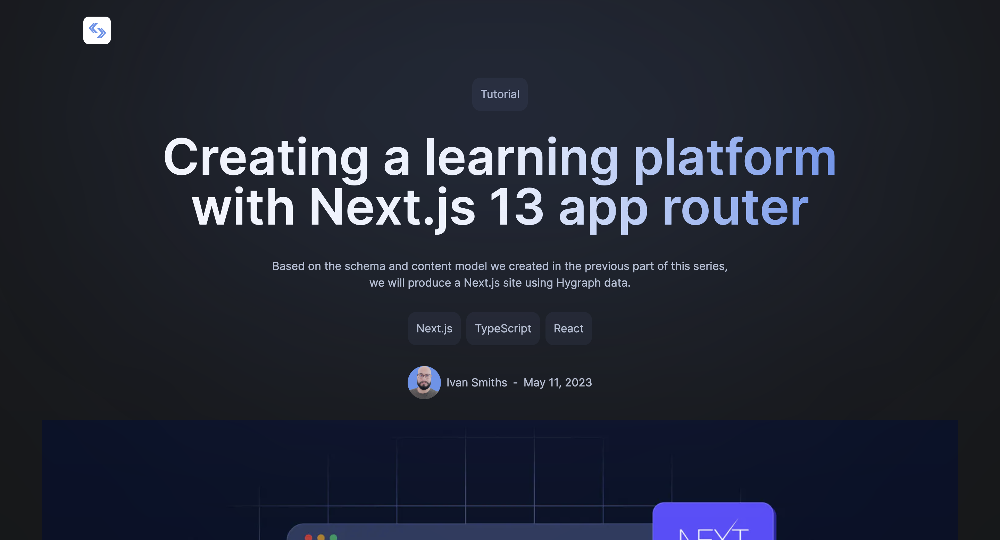
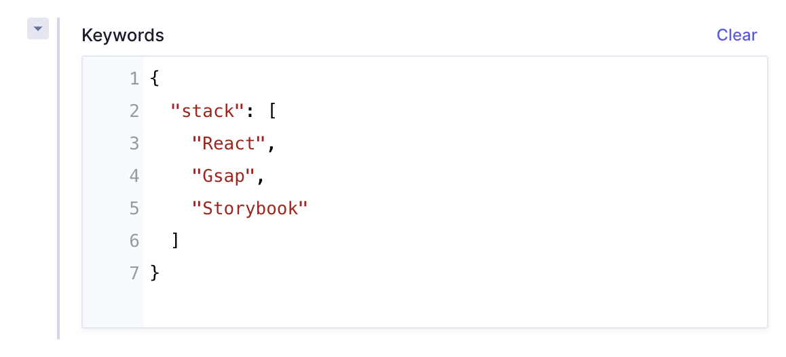
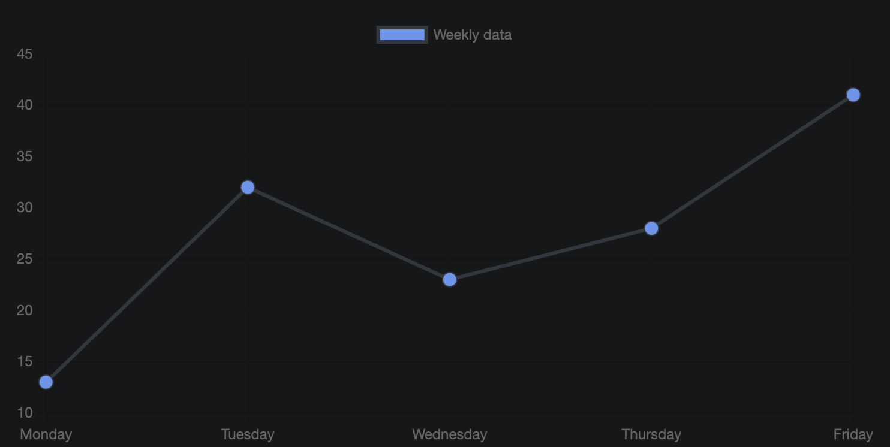
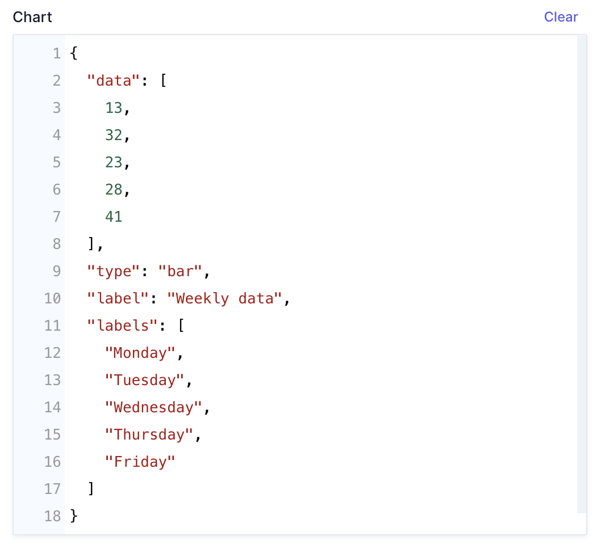

# HyBlog   Next.js & Hygraph typesafe blog starter

A (work in progress) starter repo for a blog website built with:
- Next.js (app router)
- TypeScript
- Hygraph
- Tailwind CSS
- Chart.js for data visualisation
- React Synthax Highlighter for highlighting code blocks.

Home page and blog posts pages are styled, as well as some components (block quotes, chart, code blocks or example), more components will follow soon.

## Get up and running

[Login to your Hygraph account](https://auth.hygraph.com/login?state=hKFo2SBtVjVaNEtOTGNBUzc3ZzdlZktlelFocnNyNUFMRGU0ZqFupWxvZ2luo3RpZNkgVWJMcWR3X2xJaV9wVGk4Y1ZxcGxHNTRkN1J2RDh4XzmjY2lk2SA4VldTZHlVaHRaVDQzbkFpcHIyZmpLUmhqSm1wOHNZeQ&client=8VWSdyUhtZT43nAipr2fjKRhjJmp8sYy&protocol=oauth2&response_type=id_token&redirect_uri=https%3A%2F%2Fapp.hygraph.com%2Fauth&scope=openid%20https%3A%2F%2Fgraphcms.com%2FloginsCount&mode=login&nonce=kosQOJcAcpy4~ImeadghrxDX8OuCzcTL&auth0Client=eyJuYW1lIjoiYXV0aDAuanMiLCJ2ZXJzaW9uIjoiOS4xOS4xIn0%3D) and create a new template, selecting the **"Basic blog"** template provided by the Hygraph's team.

Create a `.env.local` file in the root of this repository and add the following line: `HYGRAPH_ENDPOINT=insert-your-endpoint-here`.
For finding the endpoint, click on the link "Project Settings" in the sidebar on the left, then on "API Access". The string that you want to copy is the "Content API".

## Schema structure

The schema have two optional extra field compared to the **"Basic blog"**'s schema:

### - Keywords

 A **JSON Editor** and is used for displaying the keywords (an array of strings) of the blogpost.

 

### - Chart

A  **JSON Editor** used for display data with charts.

### Json data structure:

- data: The data that will be shown.
- type: It defines the type of charts to be displayed. See the [full list of types here](https://www.chartjs.org/docs/latest/charts/area.html). If the type is not set, a bar chart will be displayed by default.
- label: The "title" of the chart.
- labels: An array that will be used as labels in the chart.

Logo by <a href="https://www.freepik.com/free-vector/gradient-code-development-logo_11817413.htm#query=dev%20logo%20marketing&position=0&from_view=keyword&track=ais&uuid=b3f1ecea-40b2-490c-aee5-62365fdc170a">Freepik</a>
